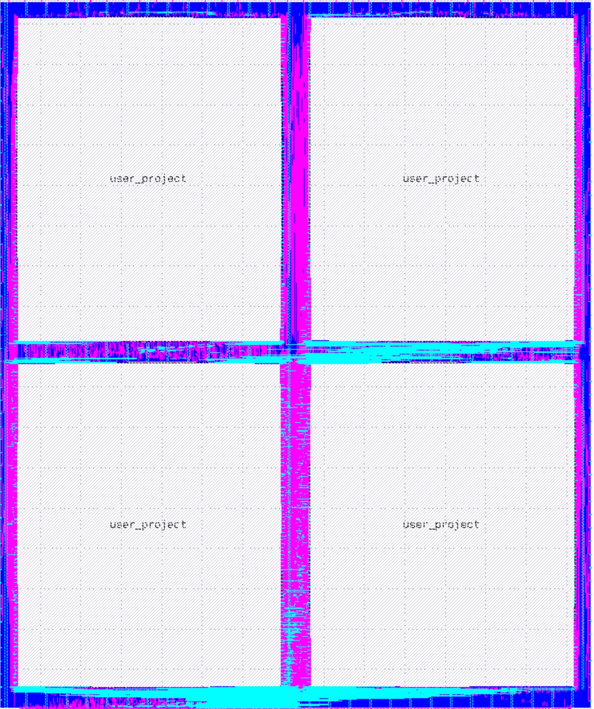

# Multi-Project Support for Caravel
The objective is to enable multiple users to share the same Caravel chip. This would allow several small MPW projects to be implemented into a single chip, increasing the number of designs per each MPW run. 

To minimize the effort, we leverage the existing Caravel chip design through a custom user’s project wrapper design. This unique design partitions the user’s project area between multiple projects. After fabrication, only one design can be active at any time. Design selection is performed through two dedicated I/O pads.

## Configurations
The number of projects per chip depends on the configuration. We planned 3 configurations: 
- [4 (2x2) designs], each 1.3x1.6 $mm^2$ (~ 200K Sky130 HD cells) [Implemented]
- [9 (3x3) designs], each 0.85x1.0 $mm^2$ (~ 80K Sky130 HD cells)
- 20 (4x5) designs, each 0.6x0.6 $mm^2$ (~ 40K Sky130 HD cells)

 
## Benefits
For chipIgnite runs, it would reduce the fabrication cost for designs that don’t utilize the whole user’s area. Each design can still access most of Caravel user's I/Os as well as the Wishbone bus. 

## Project's Resources
Each project gets the following:
- Area of 1300 um x 1600 um (for 4 projects/chip configuration)
- 36 IO ports.
- 32 logic analyzer probes only.
- Wishbone port connection to the management SoC wishbone bus.
- 1 digital power domain only.

## Limitations:
- Analog IOs are not supported.
- Metal5 cannot be used in the user's project.
- The User's project has a fixed PDN configuration

